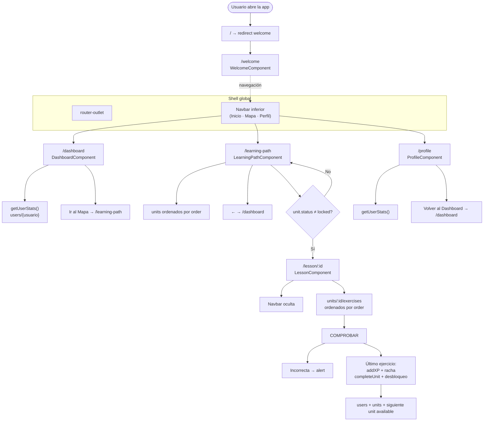
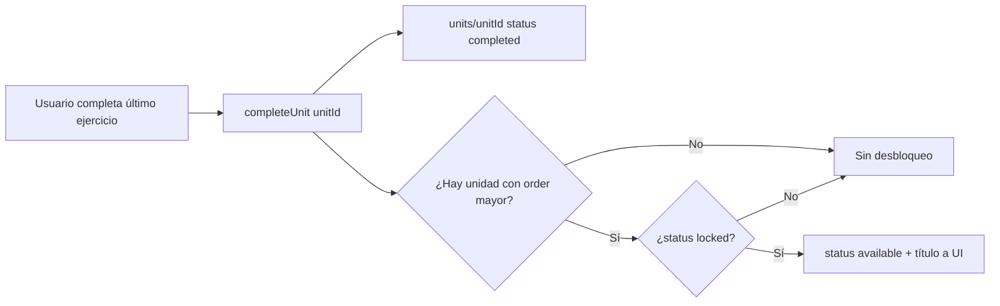

# Flujo actual de la app (app-idiomas)

Angular con rutas planas, shell global (`router-outlet` + navbar inferior) y Firebase Firestore para usuario, unidades y ejercicios dinámicos.

## Rutas

| Ruta | Componente | Rol |
|------|------------|-----|
| `/` | — | Redirección a `/welcome` |
| `/welcome` | `WelcomeComponent` | Pantalla inicial (placeholder) |
| `/dashboard` | `DashboardComponent` | Inicio: saludo, nivel, XP, racha, acceso al mapa |
| `/learning-path` | `LearningPathComponent` | Lista de unidades desde Firestore |
| `/lesson/:id` | `LessonComponent` | Lección dinámica (`:id` = ID del documento de unidad) |
| `/profile` | `ProfileComponent` | Perfil y estadísticas |

## Shell y navegación

- **`AppComponent`**: muestra `router-outlet` y `app-navbar`.
- **Navbar inferior** (`Inicio` → `/dashboard`, `Mapa` → `/learning-path`, `Perfil` → `/profile`): visible en todas las rutas **excepto** cuando la URL contiene `lesson` (durante la lección la barra se oculta).

## Diagrama de flujo



---

## Estructura en Firebase (cómo nombrar colecciones y documentos)

La app lee y escribe rutas fijas de **colección** y **subcolección**. Los **IDs de documento** de unidades y ejercicios pueden ser los que elijas (por ejemplo `unit_01`, `exercise_01`), siempre que coincidan con lo que pongas en Firestore y con la ruta `/lesson/:id` (`:id` = ID del documento de la unidad).

### Vista en árbol

```
Firestore
├── users                                    ← colección raíz (nombre exacto: users)
│   └── usuario_prueba                       ← documento (ID fijo en el código actual)
│
└── units                                    ← colección raíz (nombre exacto: units)
    └── {unitId}                             ← documento por unidad (ej. unit_01)
        │                                     • El campo order define el orden en el mapa
        │                                     • El campo status: locked | available | completed
        │
        └── exercises                        ← subcolección (nombre exacto: exercises)
            └── {exerciseId}                 ← documento por ejercicio (ej. exercise_01)
                                              • El campo order define el orden dentro de la lección
```

### Rutas completas (path)

| Qué es | Ruta en Firestore | Uso en la app |
|--------|-------------------|---------------|
| Usuario actual | `users/usuario_prueba` | Objetivo de `getUserStats()`, `addXP()`, racha. El ID **`usuario_prueba`** está hardcodeado en `DataService`; para otro usuario hay que cambiar el código o parametrizar. |
| Lista de unidades | Colección **`units`** | `getUnitsFromFirebase()`: consulta con `orderBy('order', 'asc')`. |
| Una unidad | **`units/{unitId}`** | `{unitId}` es el mismo valor que `:id` en `/lesson/:id`. Ejemplo: documento `units/unit_01`. |
| Ejercicios de una unidad | **`units/{unitId}/exercises/{exerciseId}`** | `getExercisesForUnit(unitId)`: subcolección **`exercises`** bajo esa unidad, `orderBy('order', 'asc')`. |

### Nombres que deben respetarse (literales)

| Nombre | Tipo | Obligatorio |
|--------|------|-------------|
| `users` | Colección raíz | Sí |
| `units` | Colección raíz | Sí |
| `exercises` | Subcolección bajo cada `units/{unitId}` | Sí |
| `usuario_prueba` | ID del documento de usuario | Sí en la versión actual del código |

Los IDs `unitId` y `exerciseId` son **libres** (strings), pero deben ser únicos dentro de su colección/subcolección.

### Campos esperados por documento

**`users/{userId}`**

| Campo | Tipo | Notas |
|-------|------|--------|
| `username` | string | |
| `xp` | number | |
| `level` | string | Recalculado en cliente al ganar XP |
| `streak` | number | Racha diaria |
| `lastStreakDate` | string | `YYYY-MM-DD` (fecha local) |

**`units/{unitId}`**

| Campo | Tipo | Notas |
|-------|------|--------|
| `title` | string | Título en el mapa |
| `description` | string | Opcional en UI según plantilla |
| `order` | number | Orden global del camino (**requerido** para queries e índices) |
| `status` | string | `locked` \| `available` \| `completed` |
| `icon` | string | Emoji u opcional según UI |
| `xpReward` | number | **Opcional.** La app **no** suma XP desde el documento de la unidad; la XP que se guarda en `users` sale **solo** de cada documento en `exercises` (`xpReward` por ejercicio). Este campo puede servir como referencia en CMS o panel. |

**`units/{unitId}/exercises/{exerciseId}`**

| Campo | Tipo | Notas |
|-------|------|--------|
| `type` | string | `word_order`, `translate_text`, `multiple_choice`, `match_words`, `listen_and_write` |
| `question` | string | Enunciado |
| `correctAnswer` | string | Texto normalizado para comparar (espacios/minúsculas en la app) |
| `order` | number | Orden dentro de la lección |
| `xpReward` | number | XP al acertar ese ejercicio |
| `difficulty` | string | Opcional |
| `languageFrom` / `languageTo` | string | Opcional |
| `status` | string | Opcional |
| `wordBank` | array de strings | Recomendado en `word_order` (correctas + distractores) |
| `choices` | array de strings | Recomendado en `multiple_choice` (incluye la correcta) |
| `matchPairs` | array de `{ left, right }` | Recomendado en `match_words` |
| `audioUrl` | string | Opcional en `listen_and_write` |

**Tipos y alias al cargar:** En la consola de Firebase a veces `order` y `xpReward` quedan como **string** (`"50"`). La app los **convierte a número** al leer (`normalizeExerciseFromFirestore` en `src/app/models/exercise-from-firestore.ts`). El campo **`words`** se acepta como alias de **`wordBank`**: puede ser **array**, **string con JSON** de array (p. ej. `["café","quisiera"]`), o texto separado por comas. Conviene que los tokens de `word_order` permitan formar exactamente `correctAnswer` (espacios y palabras).

### Índices en Firestore

- **`units`**: consulta `orderBy('order')` — suele crearse automáticamente o pedirte un índice compuesto si añades filtros.
- **`units/{unitId}/exercises`**: consulta `orderBy('order')` en la subcolección — igual criterio.

---

## Racha diaria (Firebase)

- La racha completa se aplica en el **último ejercicio** de la unidad (`addXP` con `applyStreak: true`). Los ejercicios intermedios suman XP sin actualizar la racha (`applyStreak: false`).
- **`addXP`** usa **`runTransaction`**: lee el documento del usuario en el servidor, suma la XP y escribe. Así cada ejercicio acumula sobre el total real y no se pierde XP por caché del cliente entre ejercicios seguidos.
- **Mismo día** (`lastStreakDate === hoy`): no incrementa el contador de racha otra vez ese día.
- **Día siguiente** al último registro: racha +1.
- **Más de un día sin actividad** o primera vez: racha = 1.

Lógica: `computeNextStreak()` en `src/app/services/data.service.ts`.

## Desbloqueo de unidades y progresión del mapa

La progresión del camino de aprendizaje **no** se calcula en el componente del mapa: se basa en el campo **`status`** de cada documento en `units/{unitId}` y en el orden numérico **`order`**.

### Estados de una unidad (`status`)

| Valor | Qué significa en la app | UI en el mapa (`LearningPathComponent`) |
|-------|--------------------------|----------------------------------------|
| `locked` | Unidad bloqueada; el usuario aún no puede entrar. | Clase CSS `locked` (apariencia atenuada/gris). **No** se muestra el botón **Empezar**. |
| `available` | Unidad desbloqueada; puede iniciar la lección. | Clase `available`. Botón **Empezar** visible → navega a `/lesson/{unitId}`. |
| `completed` | El usuario terminó todos los ejercicios de esa unidad al menos una vez (tras `completeUnit`). | Clase `completed` (resaltado, p. ej. verde). Botón **Empezar** sigue visible: puede **repetir** la lección. |

El mapa lista todas las unidades con `getUnitsFromFirebase()` (tiempo real con `onSnapshot`). Cada fila muestra `title`, `icon`, el texto del `status` y el botón según la tabla anterior.

### Cómo se desbloquea la siguiente unidad (flujo automático)

Cuando el usuario acierta el **último ejercicio** de una lección, `LessonComponent` llama a `DataService.completeUnit(unitId)` **después** de sumar la XP del último ejercicio y aplicar la racha.

Pasos internos de `completeUnit(unitId)`:

1. **Marca la unidad actual** en Firestore: `units/{unitId}` → `status: 'completed'`.
2. **Lee todas las unidades** de la colección `units`, ordenadas por `order` (ascendente).
3. **Busca la siguiente** unidad cuyo `order` sea mayor que el de la unidad completada.
4. Si esa siguiente unidad existe y su `status` es **`locked`**, la actualiza a **`available`**.
5. **Devuelve** a la UI:
   - `nextUnitUnlocked: true` y `nextUnitTitle` (título de esa unidad), si se desbloqueó algo;
   - `nextUnitUnlocked: false` si no había siguiente, ya estaba disponible o no estaba en `locked`.

La primera unidad del camino debe crearse en Firebase con `status: 'available'` (o la que quieras como punto de entrada). El resto suele empezar en `locked` para que solo se abran al completar la anterior.



### Configuración inicial recomendada en Firestore

| Unidad (ejemplo) | `order` | `status` inicial |
|------------------|---------|------------------|
| Primera del camino | 1 | `available` |
| Segunda | 2 | `locked` |
| Tercera | 3 | `locked` |
| … | n | `locked` |

### Qué **no** hace el desbloqueo hoy

- No desbloquea varias unidades a la vez (solo la **inmediata** siguiente por `order`).
- No revierte unidades si el usuario repite una lección ya completada.
- No guarda progreso parcial de una unidad a medias (si sale a mitad de lección, la unidad sigue `available` hasta que termine el último ejercicio).

---

## Tipos de ejercicio soportados

Cada documento en `units/{unitId}/exercises/{exerciseId}` define el campo **`type`**. La lección renderiza una UI distinta por tipo:

| `type` | Interacción del usuario |
|--------|-------------------------|
| `word_order` | Ordenar palabras (`wordBank` o `words`) para formar `correctAnswer`. |
| `translate_text` | Escribir la traducción en un textarea. |
| `multiple_choice` | Elegir una opción de `choices`. |
| `match_words` | Emparejar `matchPairs` (izquierda ↔ derecha). |
| `listen_and_write` | Escuchar `audioUrl` (opcional) y escribir la respuesta. |

Si el `type` no está en la lista, la lección muestra un mensaje de tipo no soportado.

---

## Comportamiento por pantalla

### Welcome (`/welcome`)

| Aspecto | Detalle |
|---------|---------|
| **Componente** | `WelcomeComponent` |
| **Estado actual** | Pantalla placeholder (`welcome works!`). |
| **Firebase** | No consulta Firestore. |
| **Navbar** | Visible (usuario puede ir a Inicio / Mapa / Perfil manualmente). |
| **Entrada a la app** | La ruta `/` redirige aquí; no hay login ni onboarding implementado. |

**Uso previsto:** pantalla de bienvenida, elegir idioma o botón “Empezar” hacia `/dashboard` o `/learning-path` (pendiente de diseño).

---

### Dashboard (`/dashboard`)

| Aspecto | Detalle |
|---------|---------|
| **Componente** | `DashboardComponent` |
| **Datos** | `DataService.getUserStats()` → documento `users/usuario_prueba` en tiempo real (`onSnapshot`). |
| **Mientras carga** | Mensaje “Conectando con la base de datos de Firebase…”. |
| **Si falla** | `catchError` devuelve `null` y la vista no rompe (estado vacío). |

**Qué muestra:**

- Saludo con `username`.
- Badge de **nivel** (`level`) con clase CSS según la primera palabra del nivel (p. ej. `principiante`, `avanzado`).
- **Racha** en la cabecera: `streak` + texto “día(s)”.
- Tarjeta de progreso: nivel, **XP acumulada** (`xp`), línea de racha diaria.
- Botón **Ir al Mapa** → `/learning-path`.

**Niveles (calculados al ganar XP, no editados a mano en UI):**

| XP total | Nivel |
|----------|--------|
| ≥ 3000 | Experto C1 |
| ≥ 2000 | Avanzado B2 |
| ≥ 1000 | Intermedio B1 |
| ≥ 500 | Estudiante A2 |
| &lt; 500 | Principiante A1 |

---

### Learning path — Mapa (`/learning-path`)

| Aspecto | Detalle |
|---------|---------|
| **Componente** | `LearningPathComponent` |
| **Datos** | `getUnitsFromFirebase()` → colección `units`, orden `order` asc, listener en tiempo real. |
| **Cabecera** | Título “Mi Camino”, botón **←** → `/dashboard`. |

**Lista de unidades:**

- Cada ítem: círculo con `icon`, `title`, texto del `status`, conector vertical (excepto el último).
- Clase del nodo: `[ngClass]="unit.status"` → estilos `locked` / `available` / `completed`.
- Botón **Empezar** solo si `unit.status !== 'locked'` → `routerLink` a `/lesson/{{ unit.id }}`.

**Actualización en vivo:** al completar una unidad en la lección, Firestore cambia `status` y el mapa se refresca solo (misma suscripción `onSnapshot`).

**Carga:** plantilla `#loading` con “Cargando mapa de lecciones…”.

---

### Lección (`/lesson/:id`)

| Aspecto | Detalle |
|---------|---------|
| **Componente** | `LessonComponent` |
| **Parámetro de ruta** | `:id` = **ID del documento de unidad** (`unitId`), no del ejercicio. |
| **Título de unidad** | `getUnitSummary(unitId)` al iniciar (campo `title`). |
| **Ejercicios** | `getExercisesForUnit(unitId)` → subcolección `exercises`, normalizados y ordenados por `order`. |
| **Navbar** | Oculta mientras la URL contiene `lesson`. |

**Durante la lección:**

- Barra de progreso: `(currentIndex + 1) / total` en porcentaje.
- Botón **✕** → `/learning-path` (sale sin forzar guardado extra).
- Por cada ejercicio: UI según `type`; botón **COMPROBAR**.
- Respuesta incorrecta: `alert('Inténtalo de nuevo.')` — **no** suma XP ni cambia racha ni unidad.
- Respuesta correcta:
  - Suma **`xpReward`** del ejercicio vía `addXP` (transacción Firestore).
  - Ejercicios **intermedios:** `applyStreak: false` (solo XP y nivel).
  - **Último ejercicio:** `applyStreak: true`, luego `completeUnit`, luego `lessonCompleted = true`.

**Acumuladores en sesión:**

- `xpEarnedThisLesson`: suma de XP de todos los aciertos de esa pasada.
- `correctAnswersCount`: cantidad de ejercicios acertados.

**Estados de carga / error:**

- Sin `unitId` válido → mensaje de unidad no válida.
- Error al cargar ejercicios → mensaje + volver al mapa.
- Unidad sin ejercicios → mensaje + volver al mapa.

**XP:** solo desde `units/{unitId}/exercises/{exerciseId}.xpReward`, **no** desde el documento de la unidad.

---

### Pantalla final de lección (`LessonCompleteComponent`)

Se muestra cuando `lessonCompleted === true` en `LessonComponent` (sustituye la UI de ejercicios, no un `alert`).

| Input | Origen |
|-------|--------|
| `unitId` | Ruta / `LessonComponent` |
| `unitTitle` | Firestore unidad |
| `xpEarned` | `xpEarnedThisLesson` (suma de la sesión) |
| `totalExercises` | `exercises.length` |
| `correctAnswers` | `correctAnswersCount` |
| `streak` | Valor devuelto por `addXP` en el último ejercicio |
| `nextUnitUnlocked` / `nextUnitTitle` | Retorno de `completeUnit()` |

| Output | Acción en `LessonComponent` |
|--------|-------------------------------|
| `continueToMap` | `router.navigate(['/learning-path'])` |
| `repeatLesson` | Reinicia índice, contadores y vuelve al primer ejercicio (**no** revierte XP ya guardada en Firebase) |
| `goToDashboard` | `router.navigate(['/dashboard'])` |

Este componente **no escribe en Firebase**; solo presenta resultados y emite eventos.

---

### Perfil (`/profile`)

| Aspecto | Detalle |
|---------|---------|
| **Componente** | `ProfileComponent` |
| **Datos** | `getUserStats()` con `startWith` loading → mismo documento `users/usuario_prueba`. |

**Estados:**

- Cargando → “Cargando perfil…”.
- Sin documento → mensaje indicando que falta `users/usuario_prueba`.
- Con datos → avatar (inicial de `username`), nombre, nivel, rejilla de estadísticas.

**Tarjetas:**

| Tarjeta | Fuente |
|---------|--------|
| Experiencia total | `user.xp` (Firebase) |
| Racha diaria | `user.streak` (Firebase) |
| Palabras nuevas | Valor fijo **124** (placeholder, no viene de Firestore) |
| Ranking actual | Texto fijo **“Liga Oro”** (placeholder) |

**Navegación:** botón **Volver al Dashboard** → `/dashboard`.

---

### Navbar inferior (global)

| Aspecto | Detalle |
|---------|---------|
| **Componente** | `NavbarComponent` (siempre en `AppComponent`, debajo del `router-outlet`) |
| **Enlaces** | Inicio → `/dashboard`, Mapa → `/learning-path`, Perfil → `/profile` |
| **Visibilidad** | `showNavbar = !url.includes('lesson')` tras cada `NavigationEnd` |
| **Activo** | `routerLinkActive="active"` en el enlace de la ruta actual |

Durante una lección el usuario solo sale con **✕** en la lección o al terminar y usar los botones de `LessonCompleteComponent`.

---

## Resumen del flujo típico del usuario

1. Abre la app → `/welcome` (placeholder).
2. Navbar → **Inicio** (`/dashboard`): ve XP, nivel y racha.
3. **Ir al Mapa** → `/learning-path`: ve unidades; solo las no `locked` tienen **Empezar**.
4. **Empezar** → `/lesson/{unitId}`: resuelve ejercicios uno a uno; gana XP por acierto.
5. Al acertar el último ejercicio: se actualiza usuario (XP, nivel, racha), unidad `completed`, posible desbloqueo de la siguiente → pantalla **`LessonCompleteComponent`**.
6. **Continuar al mapa** → ve la unidad en verde y la siguiente disponible si se desbloqueó.
7. **Perfil** → repite stats del usuario (más placeholders en palabras/ranking).

---

## Archivos de referencia

- Rutas: `src/app/app.routes.ts`
- Navbar: `src/app/components/shared/navbar/`
- Servicio: `src/app/services/data.service.ts`
- Tipos de ejercicio: `src/app/models/exercise.types.ts`
- Normalización Firestore (strings → números, `words` → `wordBank`): `src/app/models/exercise-from-firestore.ts`
- Learning path: `src/app/components/learning-path/`
- Lección: `src/app/components/lesson/`
- Pantalla fin de lección (solo UI): `src/app/components/lesson-complete/`
