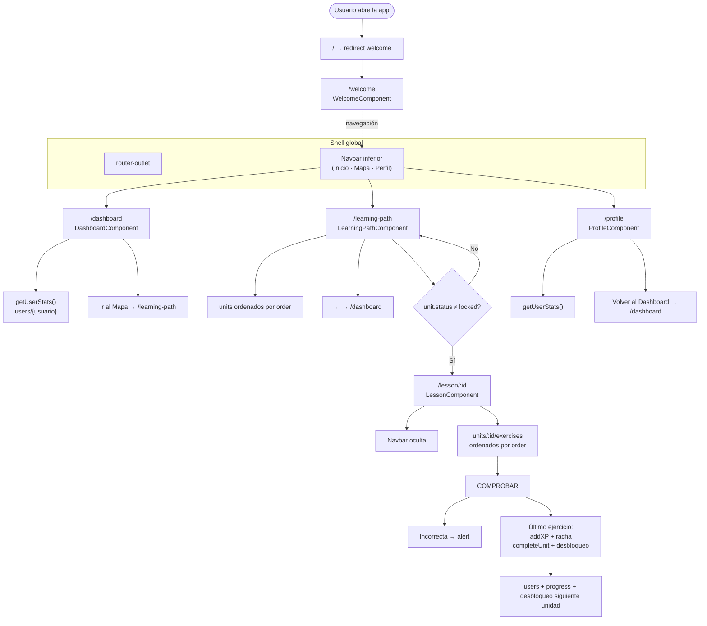
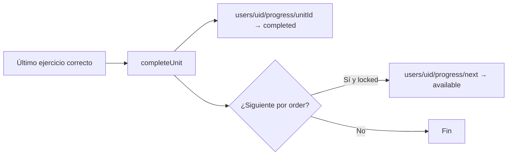

# Flujo actual de la app (app-idiomas)

Angular con rutas planas, shell global (`router-outlet` + navbar inferior), **Firebase Authentication** (email/contraseña) y **Firestore** para perfil, unidades y ejercicios dinámicos.

## Rutas

| Ruta | Componente | Protección | Rol |
|------|------------|------------|-----|
| `/` | — | — | Redirección a `/welcome` |
| `/welcome` | `WelcomeComponent` | Pública | Pantalla de bienvenida → enlace a login |
| `/login` | `LoginComponent` | `guestGuard` | Iniciar sesión / registrarse |
| `/dashboard` | `DashboardComponent` | `authGuard` | Inicio: XP, nivel, racha |
| `/learning-path` | `LearningPathComponent` | `authGuard` | Mapa de unidades |
| `/lesson/:id` | `LessonComponent` | `authGuard` | Lección dinámica |
| `/profile` | `ProfileComponent` | `authGuard` | Perfil y cerrar sesión |

- **`authGuard`**: sin sesión → redirige a `/login`.
- **`guestGuard`**: con sesión en `/login` → redirige a `/dashboard`.

## Experiencias interactivas y juego del huerto

Además de las rutas y los flujos de aprendizaje, la app incorpora experiencias interactivas dentro del módulo de juegos.

### Comportamiento del huerto

- El juego del huerto se muestra sobre un fondo visual que simula un jardín.
- Cada planta aparece inicialmente solo con su imagen, manteniendo el fondo visible y evitando saturar la interfaz.
- Al hacer clic sobre una planta, se despliegan su información, su estado de cuidado y los botones de acción.
- Los botones permiten regar y limpiar la planta para avanzar su etapa de crecimiento.
- La tarjeta de cada planta mantiene un contenedor visual transparente hasta activarse, para que el fondo del huerto se vea con mayor claridad.
- Cada planta puede moverse por el fondo mediante arrastre, con una separación mínima para evitar que se superponga con otra planta.
- El progreso general del huerto se refleja en una barra superior, actualizada a medida que las plantas reciben cuidado.

### Flujo de interacción

1. El usuario entra al juego del huerto desde la lista de juegos.
2. Visualiza el fondo y las plantas ubicadas en diferentes posiciones.
3. Al hacer clic en una planta, se activa su panel interactivo.
4. El usuario puede regar o limpiar la planta y observar cómo cambia su estado.
5. El progreso del huerto se actualiza y se muestra en el panel superior.

## Configuración en Firebase Console (pasos obligatorios)

Proyecto actual: **`app-idioma-85f50`** (debe coincidir con `app.config.ts`).

### 1. Activar Authentication

1. Abre [Firebase Console](https://console.firebase.google.com/) → tu proyecto.
2. Menú **Build** → **Authentication**.
3. Pestaña **Sign-in method**.
4. Habilita **Correo electrónico/Contraseña** (Email/Password).
5. Guarda.

Opcional: desactiva “Vincular cuentas con el mismo correo” si no lo necesitas.

### 2. Dominios autorizados (desarrollo local)

1. En **Authentication** → **Settings** → **Authorized domains**.
2. Comprueba que estén:
   - `localhost`
   - `app-idioma-85f50.firebaseapp.com`
3. Si pruebas desde otra URL (IP, dominio propio), añádela aquí.

### 3. Firestore: documento de usuario por cuenta

Cada usuario autenticado tiene su perfil en:

`users/{uid}`

donde **`uid`** es el ID que devuelve Firebase Auth (no un nombre fijo).

**Al registrarse**, la app crea automáticamente el documento con:

| Campo | Valor inicial |
|-------|----------------|
| `username` | Nombre elegido en el registro |
| `email` | Correo de la cuenta |
| `xp` | `0` |
| `level` | `Principiante A1` |
| `streak` | `0` |
| `lastStreakDate` | `''` |

**Al iniciar sesión**, si el documento no existe, `AuthService.ensureUserProfile()` lo crea con valores por defecto.

Migración del usuario de prueba antiguo (`usuario_prueba`): puedes copiar sus datos a `users/{tu uid}` manualmente en la consola o empezar de cero con una cuenta nueva.

### 4. Reglas de seguridad de Firestore (recomendado)

En **Firestore** → **Rules**, usa algo como esto para desarrollo con auth (ajústalo en producción):

```
rules_version = '2';
service cloud.firestore {
  match /databases/{database}/documents {

    match /users/{userId} {
      allow read, write: if request.auth != null && request.auth.uid == userId;

      match /progress/{unitId} {
        allow read, write: if request.auth != null && request.auth.uid == userId;
      }
    }

    match /units/{unitId} {
      allow read: if request.auth != null;
      allow write: if false;

      match /exercises/{exerciseId} {
        allow read: if request.auth != null;
        allow write: if false;
      }
    }
  }
}
```

- **Usuarios**: solo leen/escriben su propio `users/{uid}`.
- **Unidades y ejercicios**: lectura para usuarios autenticados; escritura solo desde consola o Admin SDK (contenido del curso).

Si las reglas exigen `request.auth` y Authentication no está activo, verás errores de permiso en la app.

### 5. Publicar reglas

Pulsa **Publish** en el editor de reglas después de editarlas.

### 6. Probar el flujo

1. `ng serve` → abre `http://localhost:4200`.
2. **Welcome** → **Entrar o registrarse**.
3. Pestaña **Registrarse**: correo, contraseña (mín. 6 caracteres), nombre de usuario.
4. Tras el registro → **Dashboard**; en Firestore debe aparecer `users/{uid}`.
5. Completa una lección y comprueba que `xp` sube en **ese** documento.
6. En **Perfil** → **Cerrar sesión** → vuelve a `/login`.

### 7. Errores frecuentes

| Síntoma | Causa habitual | Qué hacer |
|---------|----------------|-----------|
| `auth/operation-not-allowed` | Email/Password no habilitado | Paso 1 |
| `Missing or insufficient permissions` | Reglas Firestore sin `request.auth` | Pasos 4–5 |
| Perfil vacío tras login | No existe `users/{uid}` | Registrarse de nuevo o crear doc manual |
| Login no redirige | Dominio no autorizado | Paso 2 |

---

## Shell y navegación

- **`AppComponent`**: muestra `router-outlet` y `app-navbar`.
- **Navbar inferior**: visible en rutas con sesión (`/dashboard`, `/learning-path`, `/profile`). **Oculta** en `/welcome`, `/login` y durante `/lesson/...`.

## Diagrama de flujo



---

## Estructura en Firebase (cómo nombrar colecciones y documentos)

La app lee y escribe rutas fijas de **colección** y **subcolección**. Los **IDs de documento** de unidades y ejercicios pueden ser los que elijas (por ejemplo `unit_01`, `exercise_01`), siempre que coincidan con lo que pongas en Firestore y con la ruta `/lesson/:id` (`:id` = ID del documento de la unidad).

### Vista en árbol

```
Firestore
├── users                                    ← colección raíz (nombre exacto: users)
│   └── {uid}                                ← perfil: xp, level, streak, username…
│       └── progress                         ← subcolección: progreso del mapa POR USUARIO
│           └── {unitId}                     ← mismo ID que units/{unitId}
│               • status: locked | available | completed
│               • updatedAt (opcional)
│
└── units                                    ← contenido GLOBAL (igual para todos)
    └── {unitId}                             ← title, icon, order, description…
        │                                     • NO usar status aquí para progreso (la app lo ignora)
        │
        └── exercises                        ← ejercicios (globales)
            └── {exerciseId}
```

### Rutas completas (path)

| Qué es | Ruta en Firestore | Uso en la app |
|--------|-------------------|---------------|
| Usuario actual | `users/{uid}` | `uid` = `Auth.currentUser.uid`. `getUserStats()`, `addXP()` y racha usan ese documento. |
| Lista de unidades (contenido) | Colección **`units`** | Título, icono, orden — compartido. |
| Progreso del mapa | **`users/{uid}/progress/{unitId}`** | `status` por usuario. `getUnitsFromFirebase()` combina `units` + `progress`. |
| Una unidad (contenido) | **`units/{unitId}`** | Mismo ID que en `progress` y en `/lesson/:id`. |
| Ejercicios | **`units/{unitId}/exercises/{exerciseId}`** | Globales; mismos para todos los usuarios. |

### Nombres que deben respetarse (literales)

| Nombre | Tipo | Obligatorio |
|--------|------|-------------|
| `users` | Colección raíz | Sí |
| `progress` | Subcolección bajo **`users/{uid}`** | Sí (progreso del mapa) |
| `units` | Colección raíz | Sí |
| `exercises` | Subcolección bajo cada `units/{unitId}` | Sí |
Los IDs `unitId` y `exerciseId` son **libres** (strings), pero deben ser únicos dentro de su colección/subcolección. El ID del usuario **no** es libre: debe ser el **UID de Firebase Auth**.

### Campos esperados por documento

**`users/{userId}`**

| Campo | Tipo | Notas |
|-------|------|--------|
| `username` | string | |
| `xp` | number | |
| `level` | string | Recalculado en cliente al ganar XP |
| `streak` | number | Racha diaria |
| `lastStreakDate` | string | `YYYY-MM-DD` (fecha local) |

**`units/{unitId}`**

| Campo | Tipo | Notas |
|-------|------|--------|
| `title` | string | Título en el mapa |
| `description` | string | Opcional en UI según plantilla |
| `order` | number | Orden global del camino (**requerido** para queries e índices) |
| `icon` | string | Emoji u opcional según UI |
| `status` | string | **Obsoleto para la app.** El progreso va en `users/{uid}/progress/{unitId}`. Puedes quitarlo de `units` en Firestore. |
| `xpReward` | number | **Opcional.** La app **no** suma XP desde el documento de la unidad. |

**`users/{uid}/progress/{unitId}`**

| Campo | Tipo | Notas |
|-------|------|--------|
| `status` | string | `locked` \| `available` \| `completed` — **por usuario** |
| `updatedAt` | string | ISO opcional; la app lo escribe al completar/desbloquear |

**Inicialización:** la primera vez que el usuario abre el mapa sin documentos en `progress`, `initializeUserProgress()` crea uno por unidad: la de menor `order` → `available`, el resto → `locked`.

**`units/{unitId}/exercises/{exerciseId}`**

| Campo | Tipo | Notas |
|-------|------|--------|
| `type` | string | `word_order`, `translate_text`, `multiple_choice`, `match_words`, `listen_and_write` |
| `question` | string | Enunciado |
| `correctAnswer` | string | Texto normalizado para comparar (espacios/minúsculas en la app) |
| `order` | number | Orden dentro de la lección |
| `xpReward` | number | XP al acertar ese ejercicio |
| `difficulty` | string | Opcional |
| `languageFrom` / `languageTo` | string | Opcional |
| `status` | string | Opcional |
| `wordBank` | array de strings | Recomendado en `word_order` (correctas + distractores) |
| `choices` | array de strings | Recomendado en `multiple_choice` (incluye la correcta) |
| `matchPairs` | array de `{ left, right }` | Recomendado en `match_words` |
| `audioUrl` | string | Opcional en `listen_and_write` |

**Tipos y alias al cargar:** En la consola de Firebase a veces `order` y `xpReward` quedan como **string** (`"50"`). La app los **convierte a número** al leer (`normalizeExerciseFromFirestore` en `src/app/models/exercise-from-firestore.ts`). El campo **`words`** se acepta como alias de **`wordBank`**: puede ser **array**, **string con JSON** de array (p. ej. `["café","quisiera"]`), o texto separado por comas. Conviene que los tokens de `word_order` permitan formar exactamente `correctAnswer` (espacios y palabras).

### Índices en Firestore

- **`units`**: consulta `orderBy('order')` — suele crearse automáticamente o pedirte un índice compuesto si añades filtros.
- **`units/{unitId}/exercises`**: consulta `orderBy('order')` en la subcolección — igual criterio.

---

## Racha diaria (Firebase)

- La racha completa se aplica en el **último ejercicio** de la unidad (`addXP` con `applyStreak: true`). Los ejercicios intermedios suman XP sin actualizar la racha (`applyStreak: false`).
- **`addXP`** usa **`runTransaction`**: lee el documento del usuario en el servidor, suma la XP y escribe. Así cada ejercicio acumula sobre el total real y no se pierde XP por caché del cliente entre ejercicios seguidos.
- **Mismo día** (`lastStreakDate === hoy`): no incrementa el contador de racha otra vez ese día.
- **Día siguiente** al último registro: racha +1.
- **Más de un día sin actividad** o primera vez: racha = 1.

Lógica: `computeNextStreak()` en `src/app/services/data.service.ts`.

## Desbloqueo de unidades y progresión del mapa

**Contenido compartido** (`units` + `exercises`) + **progreso por usuario** (`users/{uid}/progress/{unitId}`).

### Estados (`users/{uid}/progress/{unitId}.status`)

| Valor | Significado | UI en el mapa |
|-------|-------------|---------------|
| `locked` | Aún no desbloqueada para este usuario | Sin botón, estilo atenuado |
| `available` | Puede entrar a la lección | Borde azul, fondo gris, **Empezar** |
| `completed` | Terminó todos los ejercicios al menos una vez | Verde, botón **Repetir** |

`getUnitsFromFirebase()` escucha en tiempo real **`units`** y **`users/{uid}/progress`**, y fusiona ambos (el `status` en `units/{unitId}` **ya no se usa**).

### Inicialización al primer acceso al mapa

Si el usuario no tiene documentos en `progress`:

1. `initializeUserProgress(uid)` lee todas las `units` por `order`.
2. Crea `users/{uid}/progress/{unitId}` para cada una.
3. La de **menor `order`** → `available`; el resto → `locked`.

Ocurre al abrir **Mi Camino** la primera vez (registro o cuenta antigua sin progreso).

### Completar y desbloquear (`completeUnit`)

Tras acertar el **último ejercicio**:

1. `users/{uid}/progress/{unitId}` → `status: 'completed'`.
2. Busca la siguiente unidad global por `order`.
3. Si su progreso está en `locked` → pasa a `available` en **`users/{uid}/progress/{nextUnitId}`** (no modifica `units`).



### Qué poner en Firestore (contenido global)

En **`units`** solo necesitas: `title`, `icon`, `order`, `description` (opcional). **No** hace falta `status` en `units` para la app.

### Usuarios existentes

- Cuenta nueva: progreso se crea solo al abrir el mapa.
- Si migras desde el sistema antiguo (status en `units` global), cada usuario debe tener su propia subcolección `progress`; el progreso viejo global **no** se migra automáticamente.

---

## Tipos de ejercicio soportados

Cada documento en `units/{unitId}/exercises/{exerciseId}` define el campo **`type`**. La lección renderiza una UI distinta por tipo:

| `type` | Interacción del usuario |
|--------|-------------------------|
| `word_order` | Ordenar palabras (`wordBank` o `words`) para formar `correctAnswer`. |
| `translate_text` | Escribir la traducción en un textarea. |
| `multiple_choice` | Elegir una opción de `choices`. |
| `match_words` | Emparejar `matchPairs` (izquierda ↔ derecha). |
| `listen_and_write` | Escuchar `audioUrl` (opcional) y escribir la respuesta. |

Si el `type` no está en la lista, la lección muestra un mensaje de tipo no soportado.

---

## Comportamiento por pantalla

### Welcome (`/welcome`)

| Aspecto | Detalle |
|---------|---------|
| **Componente** | `WelcomeComponent` |
| **Firebase** | No consulta Firestore ni Auth. |
| **Navbar** | Oculta. |
| **Acción** | Botón **Entrar o registrarse** → `/login`. |

### Login (`/login`)

| Aspecto | Detalle |
|---------|---------|
| **Componente** | `LoginComponent` |
| **Servicio** | `AuthService` (`signIn`, `signUp`, `signOut`) |
| **Modos** | **Entrar** (login) y **Registrarse** (crea cuenta + doc `users/{uid}`) |
| **Tras éxito** | Navega a `/dashboard` |
| **Si ya hay sesión** | `guestGuard` redirige a `/dashboard` |
| **Navbar** | Oculta |
| **Errores** | Mensajes en español según código Firebase (`mapAuthError`) |

---

### Dashboard (`/dashboard`)

| Aspecto | Detalle |
|---------|---------|
| **Componente** | `DashboardComponent` |
| **Datos** | `getUserStats()` → `users/{uid}` del usuario autenticado (`onSnapshot`). |
| **Mientras carga** | Mensaje “Conectando con la base de datos de Firebase…”. |
| **Si falla** | `catchError` devuelve `null` y la vista no rompe (estado vacío). |

**Qué muestra:**

- Saludo con `username`.
- Badge de **nivel** (`level`) con clase CSS según la primera palabra del nivel (p. ej. `principiante`, `avanzado`).
- **Racha** en la cabecera: `streak` + texto “día(s)”.
- Tarjeta de progreso: nivel, **XP acumulada** (`xp`), línea de racha diaria.
- Botón **Ir al Mapa** → `/learning-path`.

**Niveles (calculados al ganar XP, no editados a mano en UI):**

| XP total | Nivel |
|----------|--------|
| ≥ 3000 | Experto C1 |
| ≥ 2000 | Avanzado B2 |
| ≥ 1000 | Intermedio B1 |
| ≥ 500 | Estudiante A2 |
| &lt; 500 | Principiante A1 |

---

### Learning path — Mapa (`/learning-path`)

| Aspecto | Detalle |
|---------|---------|
| **Componente** | `LearningPathComponent` |
| **Datos** | `getUnitsFromFirebase()` → colección `units`, orden `order` asc, listener en tiempo real. |
| **Cabecera** | Título “Mi Camino”, botón **←** → `/dashboard`. |

**Lista de unidades:**

- Cada ítem: círculo con `icon`, `title`, texto del `status`, conector vertical (excepto el último).
- Clase del nodo: `[ngClass]="unit.status"` → estilos `locked` / `available` / `completed`.
- Si `status === 'available'`: botón **Empezar** (estilo azul).
- Si `status === 'completed'`: botón **Repetir** (estilo verde outline).
- Si `status === 'locked'`: sin botón.
- Ambos botones navegan a `/lesson/{{ unit.id }}`.

**Actualización en vivo:** al completar una unidad en la lección, Firestore cambia `status` y el mapa se refresca solo (misma suscripción `onSnapshot`).

**Carga:** plantilla `#loading` con “Cargando mapa de lecciones…”.

---

### Lección (`/lesson/:id`)

| Aspecto | Detalle |
|---------|---------|
| **Componente** | `LessonComponent` |
| **Parámetro de ruta** | `:id` = **ID del documento de unidad** (`unitId`), no del ejercicio. |
| **Título de unidad** | `getUnitSummary(unitId)` al iniciar (campo `title`). |
| **Ejercicios** | `getExercisesForUnit(unitId)` → subcolección `exercises`, normalizados y ordenados por `order`. |
| **Navbar** | Oculta mientras la URL contiene `lesson`. |

**Durante la lección:**

- Barra de progreso: `(currentIndex + 1) / total` en porcentaje.
- Botón **✕** → `/learning-path` (sale sin forzar guardado extra).
- Por cada ejercicio: UI según `type`; botón **COMPROBAR**.
- Respuesta incorrecta: `alert('Inténtalo de nuevo.')` — **no** suma XP ni cambia racha ni unidad.
- Respuesta correcta:
  - Suma **`xpReward`** del ejercicio vía `addXP` (transacción Firestore).
  - Ejercicios **intermedios:** `applyStreak: false` (solo XP y nivel).
  - **Último ejercicio:** `applyStreak: true`, luego `completeUnit`, luego `lessonCompleted = true`.

**Acumuladores en sesión:**

- `xpEarnedThisLesson`: suma de XP de todos los aciertos de esa pasada.
- `correctAnswersCount`: cantidad de ejercicios acertados.

**Estados de carga / error:**

- Sin `unitId` válido → mensaje de unidad no válida.
- Error al cargar ejercicios → mensaje + volver al mapa.
- Unidad sin ejercicios → mensaje + volver al mapa.

**XP:** solo desde `units/{unitId}/exercises/{exerciseId}.xpReward`, **no** desde el documento de la unidad.

---

### Pantalla final de lección (`LessonCompleteComponent`)

Se muestra cuando `lessonCompleted === true` en `LessonComponent` (sustituye la UI de ejercicios, no un `alert`).

| Input | Origen |
|-------|--------|
| `unitId` | Ruta / `LessonComponent` |
| `unitTitle` | Firestore unidad |
| `xpEarned` | `xpEarnedThisLesson` (suma de la sesión) |
| `totalExercises` | `exercises.length` |
| `correctAnswers` | `correctAnswersCount` |
| `streak` | Valor devuelto por `addXP` en el último ejercicio |
| `nextUnitUnlocked` / `nextUnitTitle` | Retorno de `completeUnit()` |

| Output | Acción en `LessonComponent` |
|--------|-------------------------------|
| `continueToMap` | `router.navigate(['/learning-path'])` |
| `repeatLesson` | Reinicia índice, contadores y vuelve al primer ejercicio (**no** revierte XP ya guardada en Firebase) |
| `goToDashboard` | `router.navigate(['/dashboard'])` |

Este componente **no escribe en Firebase**; solo presenta resultados y emite eventos.

---

### Perfil (`/profile`)

| Aspecto | Detalle |
|---------|---------|
| **Componente** | `ProfileComponent` |
| **Datos** | `getUserStats()` → `users/{uid}` del usuario autenticado. |

**Estados:**

- Cargando → “Cargando perfil…”.
- Sin documento → mensaje para crear `users/{uid}` o volver a registrarse.
- **Cerrar sesión** → `AuthService.signOut()` → `/login`.
- Con datos → avatar (inicial de `username`), nombre, nivel, rejilla de estadísticas.

**Tarjetas:**

| Tarjeta | Fuente |
|---------|--------|
| Experiencia total | `user.xp` (Firebase) |
| Racha diaria | `user.streak` (Firebase) |
| Palabras nuevas | Valor fijo **124** (placeholder, no viene de Firestore) |
| Ranking actual | Texto fijo **“Liga Oro”** (placeholder) |

**Navegación:** botón **Volver al Dashboard** → `/dashboard`.

---

### Navbar inferior (global)

| Aspecto | Detalle |
|---------|---------|
| **Componente** | `NavbarComponent` (siempre en `AppComponent`, debajo del `router-outlet`) |
| **Enlaces** | Inicio → `/dashboard`, Mapa → `/learning-path`, Perfil → `/profile` |
| **Visibilidad** | `showNavbar = !url.includes('lesson')` tras cada `NavigationEnd` |
| **Activo** | `routerLinkActive="active"` en el enlace de la ruta actual |

Durante una lección el usuario solo sale con **✕** en la lección o al terminar y usar los botones de `LessonCompleteComponent`.

---

## Resumen del flujo típico del usuario

1. Abre la app → `/welcome` → **Entrar o registrarse** → `/login`.
2. Inicia sesión o regístrate → `/dashboard` (XP, nivel, racha de `users/{uid}`).
3. **Ir al Mapa** → `/learning-path`: ve unidades; solo las no `locked` tienen **Empezar**.
4. **Empezar** → `/lesson/{unitId}`: resuelve ejercicios uno a uno; gana XP por acierto.
5. Al acertar el último ejercicio: se actualiza usuario (XP, nivel, racha), unidad `completed`, posible desbloqueo de la siguiente → pantalla **`LessonCompleteComponent`**.
6. **Continuar al mapa** → ve la unidad en verde y la siguiente disponible si se desbloqueó.
7. **Perfil** → repite stats del usuario (más placeholders en palabras/ranking).

---

## Archivos de referencia

- Rutas: `src/app/app.routes.ts`
- Navbar: `src/app/components/shared/navbar/`
- Auth: `src/app/services/auth.service.ts`
- Guards: `src/app/guards/auth.guard.ts`, `src/app/guards/guest.guard.ts`
- Login: `src/app/components/login/`
- Servicio datos: `src/app/services/data.service.ts`
- Progreso por usuario: `src/app/models/unit-progress.types.ts`
- Tipos de ejercicio: `src/app/models/exercise.types.ts`
- Normalización Firestore (strings → números, `words` → `wordBank`): `src/app/models/exercise-from-firestore.ts`
- Learning path: `src/app/components/learning-path/`
- Lección: `src/app/components/lesson/`
- Pantalla fin de lección (solo UI): `src/app/components/lesson-complete/`
- **Vocabulario** (lecciones especializadas): `src/app/components/lesson/vocabulary-lesson.component.ts/html/css`
- **Traducción** (lecciones especializadas): `src/app/components/lesson/translation-lesson.component.ts/html/css`

---

## Componentes especializados de lecciones

A partir del refactor, `LessonComponent` delega la UI de ejercicios a componentes especializados según el tipo:

### `VocabularyLessonComponent`

| Propiedad | Tipo |
|-----------|------|
| **Maneja tipos** | `word_order`, `multiple_choice`, `match_words` |
| **Archivo** | `src/app/components/lesson/vocabulary-lesson.component.ts` |
| **Entrada** | `@Input exercise`, `@Input exerciseIndex`, `@Input totalExercises` |
| **Salida** | `@Output answerSubmitted: EventEmitter<ExerciseResult>` |
| **UI especial** | Badges de tipo, barra de progreso, validación de respuesta |

**Tipos soportados:**
- `word_order`: ordena palabras del banco hacia la respuesta.
- `multiple_choice`: selecciona una opción de una lista.
- `match_words`: empareja términos izquierda-derecha con dropdowns.

### `TranslationLessonComponent`

| Propiedad | Tipo |
|-----------|------|
| **Maneja tipos** | `translate_text`, `listen_and_write` |
| **Archivo** | `src/app/components/lesson/translation-lesson.component.ts` |
| **Entrada** | `@Input exercise`, `@Input exerciseIndex`, `@Input totalExercises` |
| **Salida** | `@Output answerSubmitted: EventEmitter<ExerciseResult>` |
| **UI especial** | Textarea, botón reproducir audio, contador de caracteres |

**Tipos soportados:**
- `translate_text`: escribe la traducción en un textarea.
- `listen_and_write`: escucha (opcionalmente) `audioUrl` y escribe la respuesta.

### Cambios en `LessonComponent`

`LessonComponent` ahora:
1. Lee el tipo del primer ejercicio.
2. Determina `lessonType` (`'vocabulary'` | `'translation'` | `null`).
3. Renderiza el componente especializado correspondiente.
4. Escucha `answerSubmitted` y gestiona XP, racha, desbloqueos.

**Evento `ExerciseResult`:**
```typescript
interface ExerciseResult {
  correct: boolean;     // ¿Respuesta correcta?
  xpEarned: number;     // XP a sumar (0 si incorrecto)
  exerciseId?: string;  // ID del ejercicio (opcional)
}
```

**Flujo:**
1. Usuario interactúa con el componente especializado.
2. Presiona COMPROBAR → `checkAnswer()` en el componente hijo.
3. Emite `answerSubmitted` con el resultado.
4. Padre (`LessonComponent`) procesa y actualiza Firebase (si es correcto).
